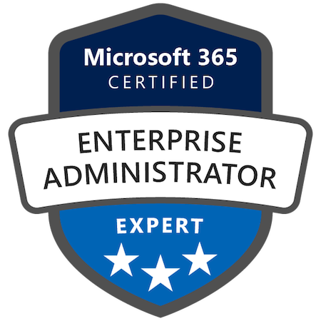
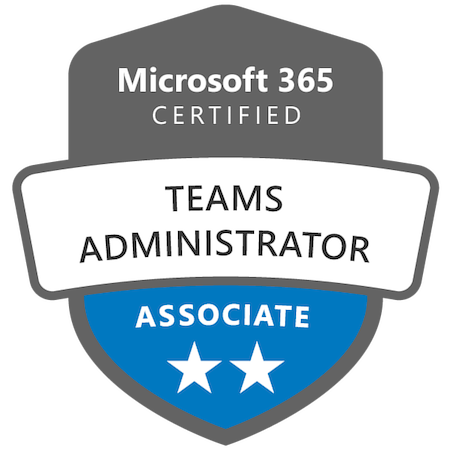
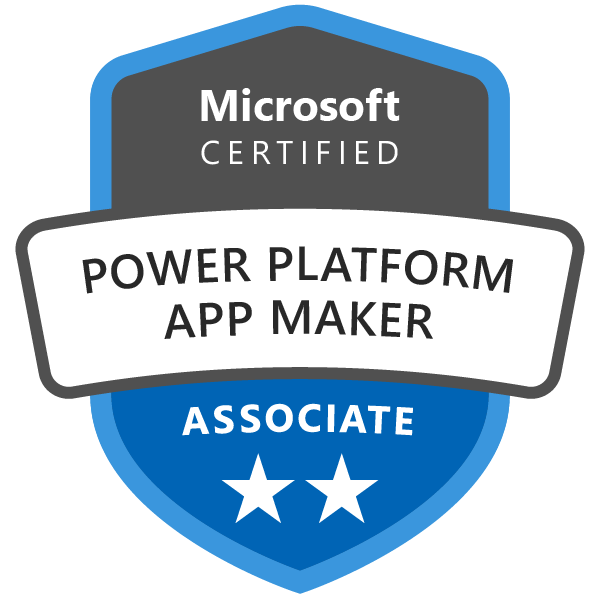
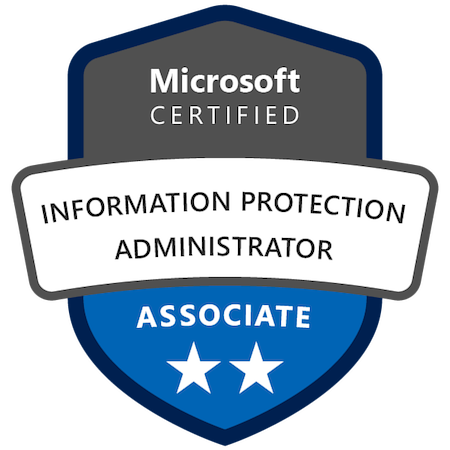

Hi, I’m Ryan Robinson. I’ve been working in technology for over 10 years, especially websites, Microsoft 365, and CRM systems. On this site I document some of the work I’ve done, whether within a full-time job, freelance work, or as a personal side project.

## Education and Certifications

I have a Bachelor of Computing Honours from Queen's University in Kingston, Ontario, Canada, with a specialization in Cognitive Science.

I also have a Master of Divinity, but that is not as relevant for this site.

More recently, I have obtained Microsoft 365 certifications:

### Microsoft 365 Certified: Enterprise Administrator Expert

_Exams MS-700, MS-100, and MS-101_

### Microsoft 365 Certified: Teams Administrator Associate

_Exam MS-700_

### Microsoft Certified: Power Platform App Maker Associate

_Exam PL-100_

### Microsoft Certified: Information Protection Administrator Associate

_Exam SC-400_

## Alliteration Applications

I have previously completed freelance work under the name of Alliteration Applications. This started with some BlackBerry mobile applications but progressed to websites (mostly WordPress), email migrations, Microsoft 365 support, and occasional other bits and pieces of IT support.

I have begun winding down the use of that branding as my focus is on my full-time employment. I am still open to occasional freelance work, but the Alliteration Applications name and official business is being phased out.
